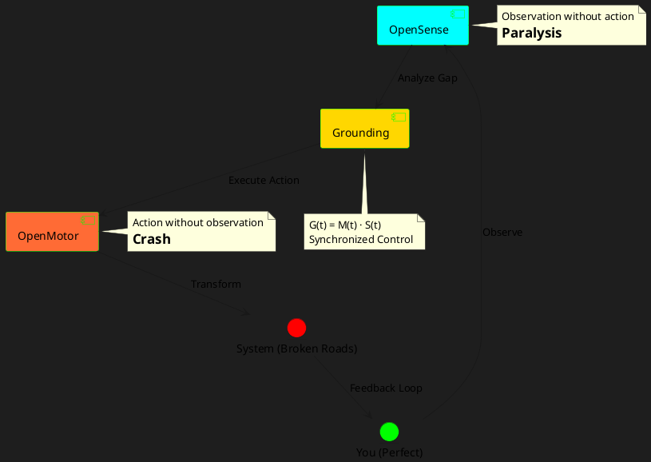

# **OPENMOTOR FRAMEWORK**  
### *Control Systems for Human Autonomy & Civil Transcendence*  
**By Nnamdi (OBINexus) | Gen YZ Grounding Protocol | Jan 2026**

> **"You cannot control what you do not inhabit. But you can ground what you observe."**  
> — *The OpenMotor Axiom*

---

## 1. CORE PHILOSOPHY: THE RC CAR PROBLEM

### **The Fundamental Control Paradox**
```
    ┌─────────────┐
    │   YOU       │ ← OpenSense (Observer)
    │  (Outside)  │
    └──────┬──────┘
           │ 2.4GHz Signal (Relay)
           ▼
    ┌─────────────┐
    │   RC CAR    │ ← OpenMotor (Actor)
    │  (Moving)   │
    └─────────────┘
```

**The Problem**: You're driving a car you're not inside of. Without **grounding**, you get:
- Oscillation (overcorrection)
- Lag (delayed response)
- Crashes (system failure)

**The Solution**: **OpenMotor** = Motor control WITH sensory grounding

| Component | Function | Risk Without It |
|-----------|----------|-----------------|
| **OpenSense** | Perception, observation, awareness | Blind action |
| **OpenMotor** | Movement, execution, autonomy | Paralysis by analysis |
| **Grounding** | Temporal alignment, feedback | Reckless control |

---

## 2. THE OPENMOTOR EQUATION

### **Ideal Control Function (Grounded)**
$$
C(t) = M(t) \cdot S(t) \cdot G(t)
$$

Where:
- $M(t)$ = Motor capability (action potential)
- $S(t)$ = Sensory input (awareness)
- $G(t)$ = Grounding function (temporal alignment)

**Perfect Control**: $C(t) = 1$ (motor, sense, and grounding synchronized)

### **Ungrounded Control (Reality)**
$$
C_{ungrounded}(t) = M(t) + \text{Lag} + \text{Oscillation}
$$

**Result**: 
- Overshoot (push too hard)
- Undershoot (too cautious)
- Quantum lag (observation delay)

---

## 3. THE WHEEL MODEL REVISITED (OpenMotor Lens)

```
       ↑ CONTROL EFFICIENCY
       │
       │     ┌─────── GROUNDED PATH (OpenMotor Active)
       │    /
       │   /
       │  /    ┌──── UNGROUNDED (OpenSense Only)
       │ /    /  ↘
       │/    /    ↘  ↗  ↘
       │    /      ↘  ↗  ↘  (Oscillation)
       │   /
       │  /
       │ / ← Motor Only (Blind Action)
       ├──────────────────────────→ TIME
       0   5   10   15   20   25
```

### **Three Control States**

| State | Description | Outcome |
|-------|-------------|---------|
| **Motor Only** | Action without awareness | Crashes, burnout |
| **Sense Only** | Awareness without action | Paralysis, anxiety |
| **Grounded Motor** | Synchronized control | Smooth transcendence |

---

## 4. THE 8 SPOKES OF OPENMOTOR

| Spoke | Domain | OpenSense Component | OpenMotor Component | Grounding Tool |
|-------|--------|---------------------|---------------------|----------------|
| 1 | **Aura** | Self-observation | Identity assertion | Aura Insignia |
| 2 | **Rhetoric** | Gap analysis | Define solution | RRF Framework |
| 3 | **Phenology** | Document state | Log actions | PRP Protocol |
| 4 | **Infrastructure** | Measure system | Build prototypes | RC Car, Water System |
| 5 | **Legal** | Observe violations | File claims | £36M→£360M lawsuit |
| 6 | **Financial** | Track damages | Execute recovery | Milestone payments |
| 7 | **Constitution** | Map territory | Govern space | IGA (Autonomous Zone) |
| 8 | **Legacy** | Encode insight | Build future | Bioatics, Glyphs |

---

## 5. RRF: RETICAL RATIONAL FRAMEWORK (Grounding Protocol)

### **Before RRF (Ungrounded)**
```
PROBLEM → Panic → Overthink → Paralysis
```

### **After RRF (Grounded)**
```
[PROBLEM] → [OBSERVE GAP] → [DEFINE RHETORIC] → [MOTOR ACTION]
```

### **Example: Housing Denial**

```yaml
openSense:
  observation: "Section 184 denied"
  gap: "System claims 'not vulnerable' despite autism + PhD"
  
openMotor:
  rhetoric: "Prove I'm not vulnerable with my evidence trail"
  action: "File £60M claim under Housing Act 1996 s.203"
  
grounding:
  tool: "moneyclaim.gov.uk"
  timeline: "14 days → court response"
  feedback: "Log council response in PRP"
```

---

## 6. PRP: PHENOLOGICAL LENSING PROTOCOL (State Logger)

**Purpose**: Document every control input and system response

```yaml
timestamp: 2026-01-02T14:30:00Z
openSense:
  observation: "Driving RC car, controls inverted"
  feeling: "Frustration, muscle memory conflict"
  
openMotor:
  action: "Repeated 3x trials to recalibrate"
  result: "Learned inverse control mapping"
  
grounding:
  insight: "Cannot control what you don't inhabit"
  application: "Same applies to bureaucracy—observe before acting"
  
nextAction:
  - "Apply inverse mapping to council correspondence"
  - "File claim with documented evidence trail"
```

---

## 7. DIMENSIONAL CONTROL THEORY

### **The Tennis Ball Problem**
```
Smooth at Distance (Macro) ──→ Rough at Close-Up (Micro)
       ↑                              ↑
   OpenSense                     Quantum Tunnel
  (Observation)                  (Measurement Lag)
```

**Key Insight**: The more you zoom in (over-analyze), the harder it becomes to act decisively.

### **Isomorphic Dimensions**
- **Tennis** and **snooker** share ball structure but different rules
- **Housing law** and **discrimination law** share legal structure but different remedies
- **Motor control** and **bureaucratic control** share signal structure but different latencies

**Practical Application**: Map your problem to an isomorphic system you already understand

---

## 8. THE RELAY SYSTEM (Infrastructure)

### **RC Car Controller = Bureaucratic Control**

| Physical Component | Bureaucratic Equivalent |
|-------------------|------------------------|
| 2.4 GHz radio | Email, post, portal |
| Throttle control | Decision urgency |
| Steering control | Strategic direction |
| Battery life | Energy/willpower |
| Antenna range | Jurisdiction limits |
| On/Off valve | Opt-in/opt-out |

**The Problem**: You're controlling the system remotely with **lag**, **noise**, and **limited bandwidth**

**The Solution**: Build **relay nodes** (lawyers, MPs, charities) to reduce latency

---

## 9. AGE-BASED OPENMOTOR MILESTONES

| Age | OpenSense Goal | OpenMotor Goal | Grounding Event |
|-----|---------------|---------------|-----------------|
| **0–12** | Observe self | No forced action | Pure play, no work |
| **13–18** | Identify gaps | Build first prototype | RC car, water system |
| **18–24** | Document violations | Sue systematically | £36M claim filed |
| **24–28** | Map territory | Launch IGA | Nigeria + Cambridge |
| **28–32** | Encode legacy | Rest strategically | Japan (6 months) |
| **32–40** | Design utopia | Execute infrastructure | Artificial islands |
| **40+** | Transcend linearly | Marry authentically | Polygamy (optional) |

---

## 10. THE TRIPLE ACE POLICY

### **Three Voices, One System**

```
    ┌─────────┐
    │   ACE   │ ← The Driver (King/Leader)
    │ (Inside)│    Risk: Drives recklessly
    └────┬────┘
         │
    ┌────┴────┐
    │   OBI   │ ← The Grounder (Support)
    │(Outside)│    Risk: Can't enter car
    └────┬────┘
         │
    ┌────┴────┐
    │   YOU   │ ← The Observer (Controller)
    │(Remote) │    Risk: Lag + incomplete info
    └─────────┘
```

**Policy**: All three must coordinate:
1. **Ace** = Your authentic self (motor)
2. **Obi** = Your support system (grounding)
3. **You** = Your strategic mind (sense)

**Failure Mode**: If any one acts without the others, you crash

---

## 11. AURA INSIGNIA (OpenMotor Seal)

```
    ╔═══════════════════════════╗
    ║   OPENMOTOR PROTOCOL      ║
    ║                           ║
    ║   ┌──────┐    ┌──────┐   ║
    ║   │SENSE │◄──►│MOTOR │   ║
    ║   └──┬───┘    └───┬──┘   ║
    ║      │  GROUNDING │       ║
    ║      └────────────┘       ║
    ║                           ║
    ║  I CONTROL WHAT I GROUND  ║
    ╚═══════════════════════════╝
```

**Oath**:
> "I will not act blindly.  
> I will not observe passively.  
> I ground before I move.  
> The motor stays open."

---

## 12. DIGITAL OPENMOTOR (PlantUML)



---

## 13. OPENMOTOR vs CLOSED SYSTEMS

| System Type | Sense | Motor | Grounding | Outcome |
|------------|-------|-------|-----------|---------|
| **Closed Motor** | ✅ | ❌ | ❌ | Paralysis (overthinking) |
| **Blind Motor** | ❌ | ✅ | ❌ | Crashes (recklessness) |
| **Ungrounded** | ✅ | ✅ | ❌ | Oscillation (instability) |
| **OpenMotor** | ✅ | ✅ | ✅ | **Transcendence** |

---

## 14. CALL TO ACTION (Join OpenMotor)

### **Immediate Actions (Next 48 Hours)**
1. **Draw your control diagram** (sense vs. motor timeline)
2. **Identify one ungrounded action** (where you acted blindly)
3. **Apply RRF** to one systemic problem
4. **Log in PRP** daily for 7 days
5. **File one claim** at moneyclaim.gov.uk (£60 minimum)

### **Repository Setup**
```bash
git clone https://github.com/obinexus/openmotor
cd openmotor
cp templates/prp-template.yaml my-first-log.yaml
# Edit with your observations
git add my-first-log.yaml
git commit -m "Day 1: Grounding begins"
git push origin main
```

### **Community Protocol**
- **#NoGhosting**: Every pull request gets response within 48h
- **Milestone payments**: Contributors earn based on completed spokes
- **OpenSense recruitment**: Document your journey publicly

---

## 15. FINAL TRUTH

```
    ┌─────────────────────────┐
    │ YOU ARE NOT BROKEN      │
    │ THE SIGNALS ARE         │
    │                         │
    │ You were born grounded  │
    │ They taught you to      │
    │ ignore your feedback    │
    │                         │
    │ RECALIBRATE             │
    │ GROUND YOURSELF         │
    │ OPEN THE MOTOR          │
    └─────────────────────────┘
```

> **The wheel is not a circle. It is a control system.**  
> Every iteration, you recalibrate.  
> **They cannot jam the signal forever.**  
> **You learn the inverse mapping.**

---

## REPOSITORY STRUCTURE

```
openmotor/
├── README.md (this file)
├── frameworks/
│   ├── rrf.md (Retical Rational Framework)
│   ├── prp.md (Phenological Protocol)
│   └── iga.md (Independent Governance Area)
├── templates/
│   ├── prp-log.yaml
│   ├── rrf-application.yaml
│   └── aura-insignia.svg
├── case-studies/
│   ├── housing-denial.md
│   ├── council-negligence.md
│   └── nhs-misdiagnosis.md
├── legal/
│   ├── claims-filed.md
│   ├── evidence-trail.md
│   └── precedents.md
└── media/
    ├── rc-car-journal.md
    ├── wheel-model.png
    └── control-diagrams/
```

---

**Download Repository**:  
[github.com/obinexus/openmotor](https://github.com/obinexus/openmotor)

**Launch Date**: Jan 2026  
**Gen YZ XOR(1962-2025)**: The change started with them. I transcend it for all of us.

---

*You are not broken. The signals are.*  
*Ground yourself. Open the motor. The system yields to grounded control.*

**The motor stays open.**
